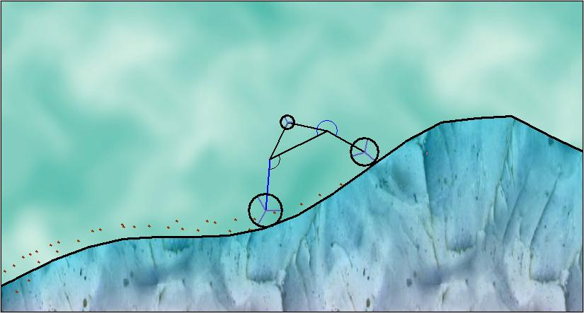



## Physic Engine 2D  V1\.2

### Description

Physic Engine 2D.

** 2D physics ** Circle-Line intersection ** Line-Line Intersection ** Vector Reflaction ** Line bounce reaction ** Large Picture Scroll ** Vector Operations ** Dyinamic links ** Particle ** Vehicle **

----

Main creature is called "bot" and is implemented by the class clsbot. It consists of: POINTS that can be pure, wheeled or motorized wheels; LINKS that work like springs and they bind the points together; MUSCLES between the links that are defined as an angle that the links should take and a strength. This Class should be used for more general pourpose, but in this case it manages the vehicle and the ground. *** New features: * Collision of not wheeled points. * Impoved doMuscles Sub. * Dynamic Links, Dynamic Muscles.
 
### More Info
 

             |
---                |---
**Submitted On**   |2009-11-09 16:27:44
**By**             |[reexre](https://github.com/Planet-Source-Code/PSCIndex/blob/master/ByAuthor/reexre.md)
**Level**          |Intermediate
**User Rating**    |5.0 (20 globes from 4 users)
**Compatibility**  |VB 6\.0
**Category**       |[Miscellaneous](https://github.com/Planet-Source-Code/PSCIndex/blob/master/ByCategory/miscellaneous__1-1.md)
**World**          |[Visual Basic](https://github.com/Planet-Source-Code/PSCIndex/blob/master/ByWorld/visual-basic.md)
**Archive File**   |[Physic\_Eng2167441192009\.zip](https://github.com/Planet-Source-Code/reexre-physic-engine-2d-v1-2__1-72621/archive/master.zip)

